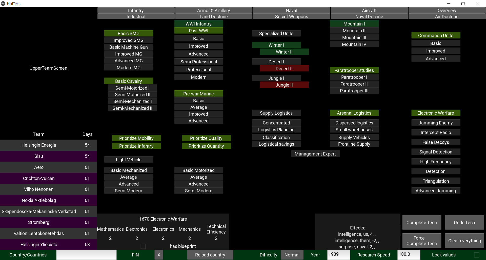

# Technology research helper app for Iron Cross

This is an attempt to "recreate" the technology research system in the game Iron Cross, which is an expansion of Hearts of Iron 2.

This app has been developed with Python 3.12.2 and Kivy 2.3.0. 

Additionally, the app needs access to the Iron Cross game files: the app looks at the file `aod_path.txt` (or `aod_path_linux.txt` if you are on linux) to find the game directory. So, in order to use the app, write the path of the game directory to that file.

