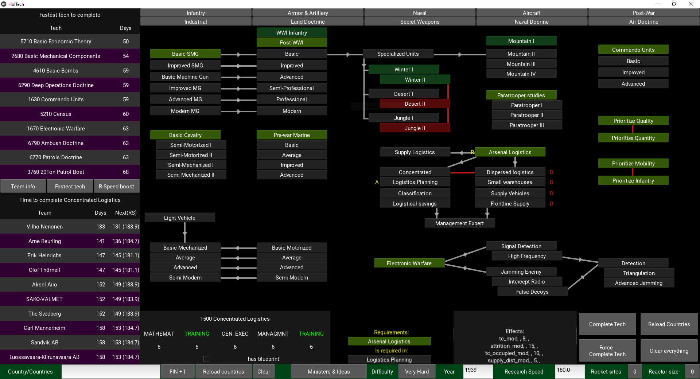
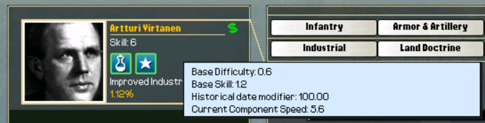

# Technology research helper app for Iron Cross


This app is a result of a bit of a deep dive into the technology research system in the game Iron Cross, which is an expansion of Hearts of Iron 2.



The use of the app requires two things:
- Python with the Kivy library
- Access to the Iron Cross game files

The app reads the file `aod_path.txt` (or `aod_path_linux.txt` if you are on linux) to find the game directory. So, in order to use the app, create that file and write the path of the game directory into it. For example, my `aod_path.txt` file contains just the line `C:\games\ArsenalofDemocracy`.

The app has been developed with Python 3.12.2 and Kivy 2.3.0, but other recent versions should work. Testing is done using pytest.

Once the requirements are satisfied, you can start the app by running
```
python main.py
```


#### Some notes

Note that the requirements for secret weapons technologies are misleading, because they also require invention events to activate and these inventions may have requirements outside of the technology system. Post-war technologies have a similar issue, in that Post-War Economy deactivates by researching Heavy Industry and is then reactivated by an event. In turn Post-War Economy reactivates Post-War Infantry, which is deactivated by Advanced Infantry. These reactivations are not included in this app, at least for now.

#### Shortcut keys

- CTRL + C completes tech (if possible)
- CTRL + F completes tech regardless of any limitations
- CTRL + U undos selected tech (if it is researched)
- CTRL + R reloads country/countries

- CTRL + 1 switches to Team Info view on the top left
- CTRL + 2 switches to Fastest Tech view on the top left
- CTRL + 3 switches to Fastest Tech view on the top left

# A brief look into the research system

Iron Cross is a grand strategy game allowing player to control practically any country in the world before, during and after World War II just like the game it is based on: Hearts of Iron 2. An important part of Iron Cross is advancing technology through research. The tech tree is the same for each country, though there are a few exclusive choices (and some of those have already been made for some countries). On the other hand, each country has their own tech teams that actually do the research. At any time, a country can have 1 - 5 tech teams researching technologies based on their size (or to be more accurate, their industrial capacity). 

<!-- 
<small>Image 1: Iron Cross technology screen</small> -->

<figure>
    
    <figcaption>Image 1: Iron Cross technology screen</figcaption>
</figure>

The bigger number of active tech teams gives a potential technological advantage to bigger countries, and this advantage is further strengthened by the fact that countries cannot share technologies, only _blueprints_, and while blueprints speed up research significantly, they are not a "get out of do-your-research" card. To balance the advantage the bigger countries have, the game gives smaller countries greater _research speed_ at the start. However, since most technologies improve research speed slightly (in addition to their more obvious effects), bigger countries will catch up to smaller countries in research speed over time.

The most interesting part about technology research in Iron Cross is the game design decision to make industrial technologies that improve economy also decrease research speed, and in fact decrease it much more than most technologies increase it. Additionally, some of these industrial technologies are requirements for further research in other areas. Thus the player is given a problem of deciding when to take their level of technology up a tier at the cost of their research speed. This problem is a significant motivator for this little journey into the the details of the research system.

In the following, we will discuss what factors have an effect on a tech team researching a technology, and more specifically how the game determines the speed of research. This is based on ingame testing and the data from testing can be found in the file [research_speed_testing.csv](tests/research_speed_testing.csv).

## What the game tells us

There are 9 categories of technologies, and every technology consists of 5 components, each of which have a type and a difficulty. In Iron Cross all components of a technology have the same difficulty, but only one technology out 775 has all its components be of the same type. All in all, there are 34 different component types in the game. 

As mentioned before, each country has its own tech teams. Tech teams have a skill and up to 5 specializations, i.e. component types that they specialize in. If a tech team specializes in the component type it is researching, its research will progress at twice the speed. 
<!-- Specialization doubles team's research speed. -->

To research a technology player must assign a tech team to research it and finish researching all of its components consecutively. If the research of a technology is cancelled, it will start from the beginning regardless of how far it had progressed before. Research progress is calculated every day, and progress can only be made in one component. This means that even if there is only 0.01% left in a component, the next day tech team will finish that component, but not do any work on the next. Thus the fastest a technology can theoretically be researched is 5 days.

<!-- 
<small>Image 2: Artturi Virtanen researching Improved Industry</small> -->

<figure>
    
    <figcaption>Image 2: Artturi Virtanen researching Improved Industry</figcaption>
</figure>

In Image 2 we see a tech team Artturi Virtanen (AIV) researching Improved Industry (II). After one day AIV has completed 1.12% of II. We notice that AIV has a skill of 6 and specializes in chemistry and management. These specializations are highlighted because II has components of those types. Ignoring the tooltip (which we will cover shortly) this image does not show that AIV does not specialize in the first component of II, there are no blueprints for II, or that II (or strictly speaking, all its components) has difficulty 4.

The tooltip gives us more information. Base Difficulty and Base Skill are important to understand, whereas Historical date modifier is completely useless leftover from the original Heart of Iron 2. And Current Component Speed (CCS) is in fact the (rounded) percentage of the component that is completed in a day. Since there are 5 components, CCS is 5 times the daily progress of the technology that a player observes: in this case $5.6 = 5 \times 1.12$. Given that we are interested in the progress of the whole technology and CCS is rounded to one decimal, we will mostly ignore it.

<!-- In my opinion it would have been clearer to have CCS be the daily progress of the whole technology, but I guess it is true to its name and is only about the current component. -->


In this case it is easy to see that $CCS = 2.8 \times BaseSkill / BaseDifficulty$, which gives us a base model for daily research completion
```math
DailyCompletion = 2.8 \times \frac{BaseSkill}{5 \times BaseDifficulty}.
```
Here the constant $2.8$ is expected, since that is the value for _tech speed modifier_ in the game file `db/misc.txt`.

There are two more things that could be showing up in the research tooltip, but in this case do not: Specialization and blueprints. As mentioned above research progresses twice as fast if the tech team specializes in the type of component it is researching. On the other hand, having blueprints for a technology multiplies the speed of research by $1.7$. This constant can also be found in the file `db/misc.txt`. In Image 3 below we see that the research tooltip mentions specialization and blueprints, if they are present.

<!-- 
<small>Image 3: Artturi Virtanen researching Advanced Vacuum Tubes</small> -->

<figure>
    
    <figcaption>Image 3: Artturi Virtanen researching Advanced Vacuum Tubes</figcaption>
</figure>

Based on this information we can refine our research completion model to include specialization and blueprints. The updated model is
```math
DailyCompletion = 2.8 \times (1 + 0.7 \times HasBlueprint) \times \frac{BaseSkill \times (1 + HasSpecial)}{5 \times BaseDifficulty},
```
where $HasSpecial$ and $HasBlueprint$ have value $1$ or $0$ depending on if they are true or false.

So far I have deliberately tried to avoid using the term _research speed_, unless referring to the actual research speed value in the game. This value can be seen in the overview tab on the technology screen. Small countries start with research speed of $180$% (this is the case in the images above), medium sized countries have research speed $140$% and major powers have research speeds below $100$%. Now it seems rather obvious that research speed does in fact affect the speed of research (while also making things confusing), but as we have seen, the research tooltip does not refer to research speed in any way (maybe to avoid confusion with Current Component Speed?). Thus the effect of research speed must have been taken into account in either Base Skill or Base Difficulty.

There are still more factors that affect research. Some ministers and ideas give bonus to research in some (or all) technology categories. In the case of above images, there is a minister that gives $10$% bonus to industrial research, and Improved Industry and Advanced Vacuum Tubes are both industrial technologies. Since this bonus is not mentioned in the research tooltip, it should be factored into Base Skill or Base Difficulty.

In the above images the green dollar sign indicates that the tech team is getting paid. Interestingly, if the player has no money, tech teams continue to do research, albeit at a slower pace, even though teams do not get paid and the dollar sign turns red. If the player directly stops funding research, then the tech teams actually stop. For the purposes of this analysis, we assume that the tech team either gets paid fully or not at all. Testing what happens if a team is paid only part of its salary gets very complicated (or maybe the game only checks if a team is paid in full, and I look stupid for not checking that...)

Finally the game itself has 5 difficulty levels, which have an effect on research. Difficulty effects (or rather their values) can be found in the file `db/difficulty.csv`. In the case of above game images, the game difficulty modifier for research is $0$, but in general, the effect of game difficulty is included in Base Skill or Base Difficulty (well, surely it is going to be in Base Difficulty? Yes).

Now before we attempt to ruin everything we have been building, it should be mentioned that the game shows a predicted date for when a tech team completes a technology. This date can be seen in Image 1 to the left of *Start Project* button. It should be noted that (quite predictably) this prediction does not take into account technologies whose research is completed before the predicted (and change research speed), events in the game that change research speed or give blueprints, or lack of money.

Were all the factors affecting the daily progress of research mentioned? Of course not. Because rocket test sites and nuclear reactors look at our models for daily research completion and laugh at their inaccuracy. Image 4 illustrates this problem.

<!-- 
<small>Image 4: Henri Coanda researching Self-Propelled Rocket Artillery (with 9 rocket test sites)</small> -->

<figure>
    
    <figcaption>Image 4: Henri Coanda researching Self-Propelled Rocket Artillery (with 9 rocket test sites)</figcaption>
</figure>

But for now, we will ignore these issues and try to make sense of what Base Skill and Base Difficulty are.

## What is Base Skill?

The answer is simple:
```math
BaseSkill = \frac{Skill + 6}{10}.
```
This actually applies nicely to the situation where tech teams are not being paid, since tech teams are paid for their skill (or at least that is how I like to think about it). So unpaid teams "have skill $0$" and their Base Skill is $0.6$ (this is what the game shows to the player). Note that specialization still doubles the daily progress of research, regardless of whether the team is paid or not.

## Brief interlude: "quick" way to choose the fastest tech team

Suppose a technology has Base Difficulty $d$ (which based on previous observations should be the same for all components) and a tech team has skill $s$. Then we can make the (inaccurate) assumption that the time it takes for the tech team to research a component they are not specialized in is proportional to $\frac{d}{s + 6}$, and the time is proportional (with the same multiplier) to $\frac{d}{2(s + 6)}$, if the team specializes in that component.

Thus, if the tech team specializes in $k$ of the $5$ components, it takes a time proportional to the quantity
```math
\frac{k \cdot d}{2(s + 6)} + \frac{(5 - k) d}{s+6} = \frac{10 - k}{s + 6} \cdot \frac{d}{2}
```
to complete the research on this technology. Here the multiplier $d/2$ is the same for each tech team, so to compare teams, it is sufficient to compare the quantities $\frac{10 - k}{s + 6}$ and see for which tech team that is smallest. Table 1 below has these quantities scaled so that a skilless (i.e. pennyless) not special team has completion time approximation of $1$.

<figure>
    
    <figcaption>Table 1: Approximate research times relative to skilless non-specialized tech team</figcaption>
</figure>

While Table 1 gives a decent idea which teams are fastest, it should be noted that rocket sites and nuclear reactors ruin it for rocket and nuclear technologies.

## What is Base Difficulty?

Well, now it gets interesting...

It seems that a lot of things are combined into Base Difficulty. So let us break things down, and try a model like this
```math
\frac{1}{5 \times BaseDifficulty} = G_{GameDifficulty} \times R_{ResearchSpeed} \times M_{MinisterBonus} \times D_{Difficulty}.
```
Here the natural guess would be that the multiplier associated with research speed $R_{ResearchSpeed}$ is the research speed itself, just not as a percentage. In other words, if for example research speed is $180$%, then $R_{ResearchSpeed} = 1.8$. (Yes, I omitted a constant from the right side of the model, because I knew it wasn't necessary, and yes the model is written in that way to avoid issues with dividing by zero, and yes this model fails when research speed is $0$, but it is not because of zero division)

As for the technology/component difficulty multiplier, we can ultimately see that Base Difficulty is proportional to $Difficulty + 2$, and in the model above we can set
```math
D_{Difficulty} = \frac{1}{Difficulty + 2}.
```

As mentioned earlier, game difficulty modifiers can be found in the file `db/difficulty.csv`. Essentially, raising the difficulty one level decreases game difficulty multiplier by $10$ percent points. In other words, we have
```math
G_{GameDifficulty} = 1 + 0.01 \times GameDifficultyModifier,
```
where $GameDifficultyModifier$ is the value in the file `db/difficulty.csv` for RESEARCH for the current game difficulty. Possible values for $GameDifficultyModifier$ are $10$, $0$, $-10$, $-20$ and $-30$.

Research bonuses from ministers and ideas are a bit more complicated to understand, mostly because they are presented differently in the game compared to the game files. Ingame each bonus is presented to be either $+10$% or $+5$%, whereas in the game files the corresponding values are $-0.1$ and $-0.05$, respectively. There is some weirdness about this (mentioned in exceptions), but for now we set
```math
M_{MinisterBonus} = \frac{1}{1 + \max\{ -0.9999, SumOfMinisterBonuses\}},
```
where $SumOfMinisterBonuses$ is the sum of all relevant (to the technology researched) minister and ideas bonuses as they are written in the game files.


All in all, so far we have the following model for daily research completion
```math
DailyCompletion = 2.8 \times (1 + 0.7 \times HasBlueprint) \times \frac{(Skill + 6) \times (1 + HasSpecial)}{10} 
```
```math
\qquad\qquad\qquad\qquad\qquad\qquad\qquad \times \frac{(1 + 0.01 \times GameDifficultyModifier) \times ResearchSpeed}{(1 + \max\{ -0.9999, SumOfMinisterBonuses\}) \times (Difficulty + 2)},
```
which is good enough for most research.

On a somewhat amusing note, from the way the model is written (and who might have written it that way I wonder...) it is more natural to think that game difficulty modifies research speed and minister bonuses modify (tech) difficulty, even though a priori one would probably think the opposite.

## The exceptions

The practical exception we should be worried about is the effect of rocket test sites and nuclear reactors. Before we get to that, let us mention some things which the player is very unlikely to run into without editing game files. What might be possible to see in regular play is the fact that Base Difficulty has a maximum value of $20$ and a minimum value of $0.1$. This is taken into account in the final model.

In our model the minister bonus term is such that dividing by zero will not be an issue. In reality, it can be, in a way. Now, if the player has $SumOfMinisterBonuses = -1S and research speed is above $0$, then Base Difficulty will be $0.1$ for every technology. However, if $SumOfMinisterBonuses = -1$ and research speed equals $0$, the game crashes. The ultimate weirdness happens if $SumOfMinisterBonuses < -1$: Then Base Difficulty will be $0.1$ for every technology even if research speed is $0$.

<!-- Before we get to the rocket test sites and nuclear reactors, it should be mentioned that the maximum value for Base Difficulty in the game is $20$. This will be taken into account in the final model, but for now let's move on. -->

<!--  For a player the effect of rocket sites is more obvious than that of reactors for two reasons (well, three if you count the idea that players build reactors to get big boom, not to speed up research): First, rocket sites can be built relatively early, so that the player can have their rocket site at max size when researching later rocket technologies. On the other hand, to even build reactors the player must have researched about half of all the nuclear technologies in the game, and is probably going to continue researching more of them while -->
Rocket test sites and nuclear reactors work somewhat similarly, when it comes to research. However, at maximum size rocket sites are much more effective in boosting research than reactors. Probably the easiest way to look at the effects of rocket test sites and reactors is to imagine them add a new tech team to assist (for free) whenever a tech team researches components of type rocketry, or nuclear engineering or nuclear physics, respectively.

In the case of rocket test sites we switch the term $\frac{(Skill + 6) \times (1 + HasSpecial)}{10}$ in our model to be
```math
\frac{(Skill + 6) \times (1 + HasSpecial)}{10} + RocketSiteSize.
```
Obviously, this only works if the technology component the tech team is researching is a rocketry component.

For nuclear reactors we make a similar swap. However this time the term we end up with is
```math
\frac{(Skill + 6) \times (1 + HasSpecial)}{10} + \sqrt{ReactorSize}.
```
Again, this works if the technology component under research has type nuclear engineering or nuclear physics.

## The final model

Our model more descriptively and come up with
```math
DailyCompletion = GlobalConstant \times BlueprintEffect \times SkillIssues \times DifficultyTerm.
```

Here 
- $GlobalConstant = 2.8$ is the value for tech speed modifier in the game file `db/misc.txt`
- $BlueprintEffect = (1 + 0.7 \times HasBlueprint)$, so this number is $1.7$ if the country has a blueprint for current technology and $1$ if not. (And $1.7$ is the value for blueprint bonus from `db/misc.txt`)

The term $SkillIssues$ depends on the skill and specialization of the tech team, the type of the component being researched, size of the rocket test site and the size of the nuclear reactor. There are 3 cases: If the technology component under research is rocketry, we have
```math
SkillIssues = \frac{(Skill + 6) \times (1 + HasSpecial)}{10} + RocketSiteSize.
```
If the technology component under research is nuclear engineering or nuclear physics, we have
```math
SkillIssues = \frac{(Skill + 6) \times (1 + HasSpecial)}{10} + \sqrt{ReactorSize}.
```
Otherwise, we have
```math
SkillIssues = \frac{(Skill + 6) \times (1 + HasSpecial)}{10}.
```

Finally the last term in our model, $DifficultyTerm$ depends on game difficulty, research speed, the category and difficulty of the technology as well as research bonuses granted by ministers and ideas. This term is
```math
DifficultyTerm = \min\left\{ 2, \max\left\{ 0.01, \frac{(1 + 0.01 \times GameDifficultyModifier) \times ResearchSpeed}{(1 + \max\{ -0.9999, SumOfMinisterBonuses\}) \times (Difficulty + 2)} \right\} \right\}.
```

## The readme has ended, nothing to see here

So I just have to mention 2 somewhat "broken" things about the research in Iron Cross.

First, there are  nice "Investing in resources" events for small countries, more specifically countries that are not GER, ITA, JAP, ENG, FRA, USA, CHI, SOV, U16, SPR, SPA, BEL, POL, ARG, BRA, HOL, CAN, AST, CZE, HUN, ROM, MEX, YUG, BUL, SWE, TUR, MAN, CGX, SAF, GRE, CSX, POR, DEN, FIN, SCH, SIA, AUS, PER, COL, NOR, CHL, PRU, U01, U02, U14, U15. These events can happen in 1933, 1936, 1938, 1940, 1942, 1944, 1946, 1948, 1950 and 1952. They allow a country with enough resources (10000 energy, 6000 metal or 3000 rare materials) to increase research speed by $20$ percent points at the cost of 9000 energy, 5000 metal or 2500 rares (well, there are two other choices, but who doesn't want to boost research speed?). There is one event for each resource, so using these events the player can increase research speed by $60$ percent points every year these events can happen.

So suppose a small country makes some conquests in the early game (with tech team and IC takeover perhaps?) while getting research boost from these events. In 1938 they can have a research speed of $360$% (plus minus other effects on research speed) with a bunch of tech team slots, while the great powers of the world are chugging along with a research speed slightly over $100$%. Communist China can take advantage of these events even in single player, but in multiplayer they are even easier to exploit.

Second thing is the ability to abandon doctrines. In Iron Cross the player generally cannot undo researched technologies. The only (but pretty big) exception to this rule are doctrines, which can be abandoned. Presumably this is so that the player can choose a different path of doctrines to research, since these paths are (often) mutually exclusive, and the game has usually picked one path beforehand and deactivated others. However, abandoning doctrines does not simple make deactivated doctrines available. Instead, the player must start research on the available doctrine and then cancel the research. After that other doctrines are made available.

Ok, so abandon doctrine is not the best implemented feature in the game. But it gets more "broken": Abandoning a doctrine gives the player the same research speed increase as completing the doctrine. This then can be exploited by researching and abandoning the same doctrine again and again for research speed gains. The Fact that the player gets a blueprint for the doctrine when abandoning it makes this exploit somewhat effective, but since blueprint bonus is so low, it doesn't seem to be truly game breaking (perhaps this is why blueprint bonus is so low?). Maybe I should do the math on that?
